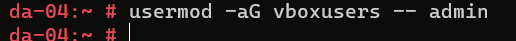
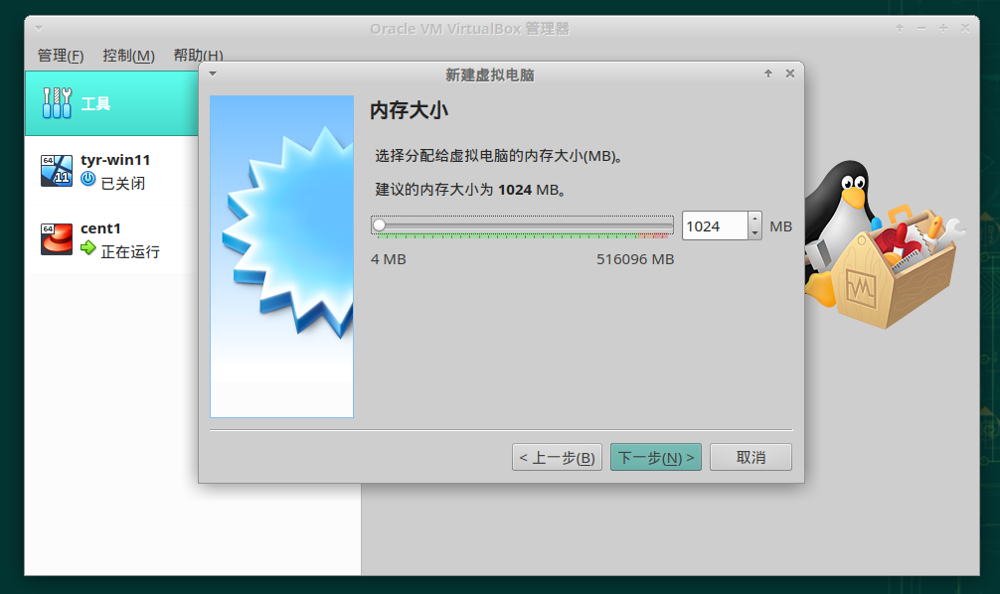
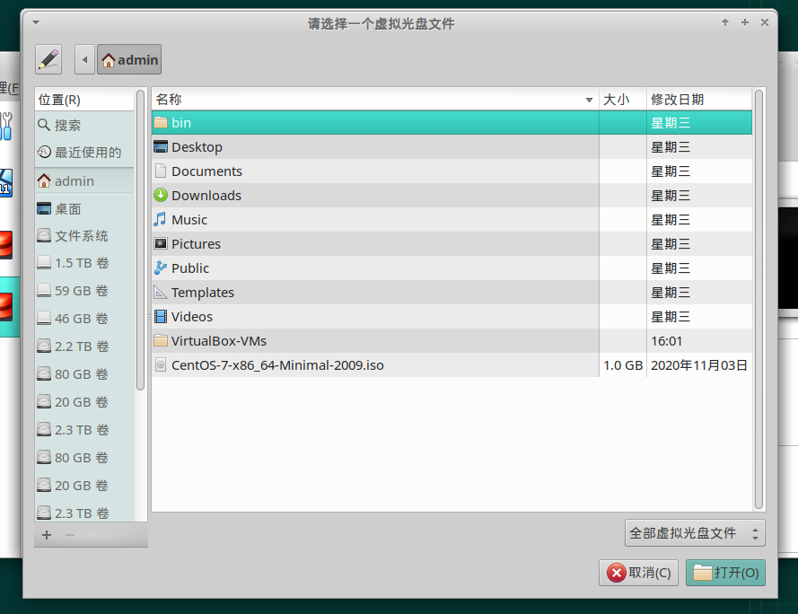
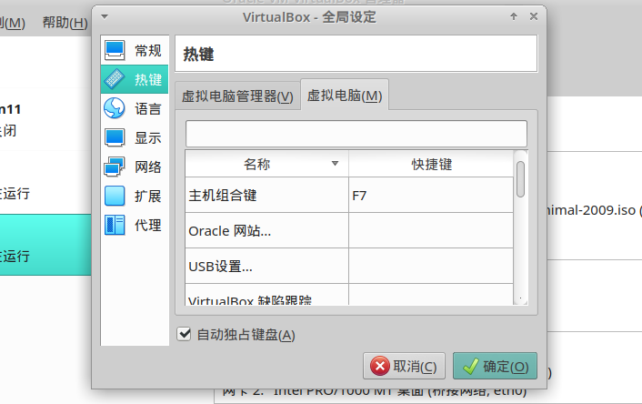
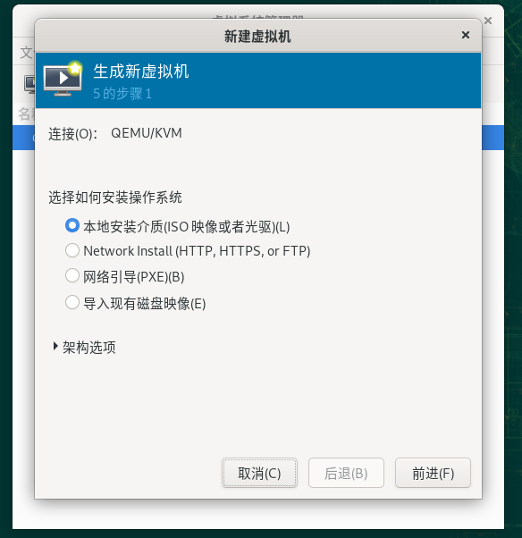
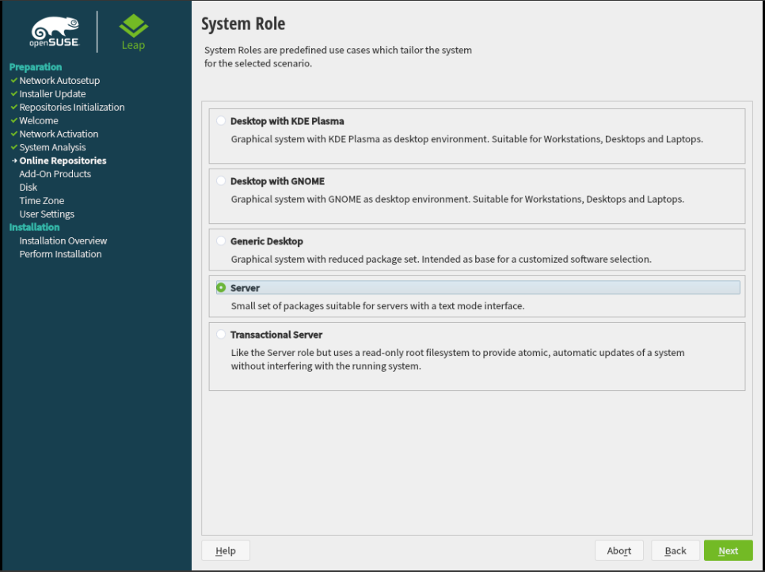
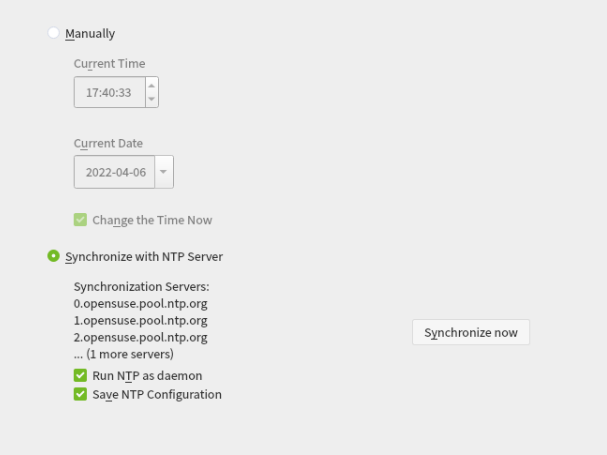
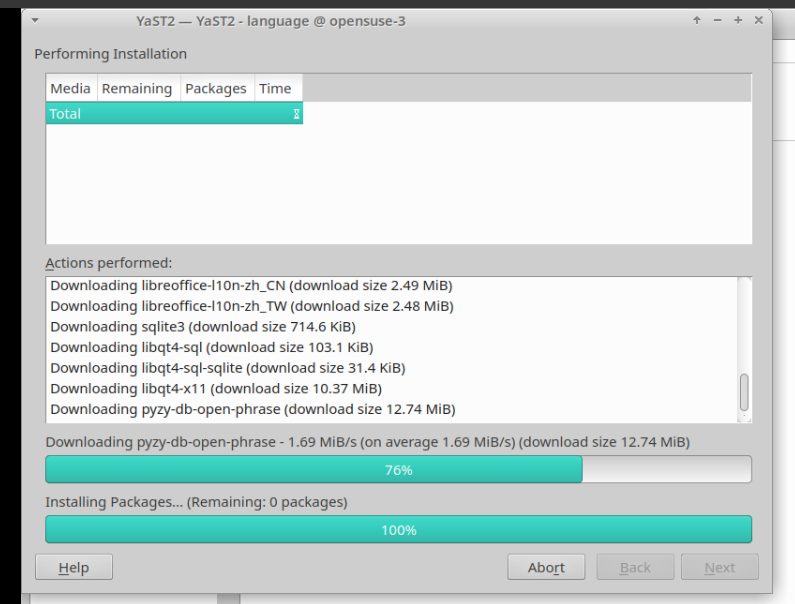

<!-- <meta charset="utf-8" emacsmode="-*- markdown -*-"> <link rel="stylesheet" href="https://casual-effects.com/markdeep/latest/journal.css?"> -->

# 【VM】基于 VirtualBox 的桥接虚机创建

## 概述

### 场景

有一台资源很多的服务器（ `10.28.3.14/24 by 10.28.3.254` ），现在呢，不是直接在这个裸机的系统上做各种操作，而是用它创建虚机。

理想的情况是创建基于 KVM 的虚机，但是相对 VBox （ virtual box ）而言后者最简单。后者也是跨平台的。

本文记录一下上述场景中如何基于 VBox 创建桥接的虚拟机。

### 资源信息

节点 `da-04` ：

- IP ： `10.28.3.14/24`
- Gayeway ： `10.28.3.254`

网关没有 DHCP 自动 IP 分配。

## 步骤

下面的步骤尽可能合乎操作的顺序。

逻辑关系则通过一些标注表明——总的来说，达到上面的目的，要做好以下方面的工作：

- 虚机操作系统安装（这里用 ISO 映像（光盘）文件做安装介质）
- 网络访问（这里用桥接）

### 0. 在服务器打开 Virtual Box 的图形界面

打开 Virtual Box 软件的前提是，能够使用 `da-04` 这个机器的裸机系统的图形界面。

然后，在其中才能用图形化的方式打开 Virtual Box 。

#### 0.1 接入节点 `da-04` 的裸机系统的桌面

这里使用的方式是 VNC Server 。它基于 `tigervnc` 这个软件，如果没有的话可以通过 `sudo zypper in -- tigervnc` 命令来安装。

可惜现在我已经装好了。并且也通过首次运行过命令 `vncserver` 给配置好密码了。在这次的示例里的 VNC 连接密码是：

- 如果想要操作的话密码是： `#EDC5tgb`
- 如果只是想观看的话密码是： `1234!@#$`

**千万不要用 root 用户执行 `vncserver` 命令，这会以 root 身份打开的桌面，这样的桌面在使用过程中会出现一些错误！**

用 admin 身份执行这个命令就是这样写： `sudo -u admin -- vncserver`

更多使用帮助请执行： `sudo -u admin -- vncserver --help`

向这样会打开一个需要 admin 身份登录的、且大小为 `1920x1080` 的桌面：

注意中的 `New 'da-04:2 (admin)' desktop is da-04:2` 这一句，这里包含了对它连接的连接方式。

要连接到某个具体的打开着的 VNC Server 服务，需要知道这两样东西： 地址、端口。

在上图我提到的那句让你注意到的话里， `da-04:2` 就是获取这两者的**线索**：

- 其中 `da-04` 是： ***地址*** 的线索。（众所周知：所谓地址当然就是一个 Hostname 或者一个 IP 了）
- 其中 `2` 是： ***端口*** 的线索：它是几，到时候连接的时候，实际要连的端口就是 `5900` 加几——在这里，它是 `2` ，那么，到时候要连接这个 VNC Server 的话，端口就应该是 `5902` 了。

下面演示使用 MobaXterm 中内置的 VNC 客户端来连接：

1. 打开 MobaXTerm ，在最左上角，点 [Session] 按钮
   
   
   
2. 在弹出的【连接种类选择界面】选择 [VNC] 
   
   
   
3. 在【地址】部分输入 `10.28.3.14` （或者别的任何对你来说连接 `da-04` 的正确地址）并对【端口】右边的 `5900` 加 `2` 使之成为 `5902`
   
   
   
4. （可选）在下面的【高级 VNC 设置】里面可以选择【只是看】——这决定待会儿你要用哪个密码以及进去后能不能操作还是只能看（我这里没有勾选所以待会要用【如果想要操作的话】的那个密码）
   
   
   
5. 点那个【OK】就可以连接了（它会问你要 VNC 连接的密码）（可以勾选【记住密码】）
   
   输入正确的连接密码（这里是 `#EDC5tgb` ）**之后**就可以看到下面的界面
   
   
   
   然后再正常输入这个裸机系统里的 `admin` 用户的登录密码再点【解锁】就进去了
   
   
   

#### 0.2 在节点 `da-04` 的裸机系统的桌面打开 Virtual Box

点桌面左下角的【MENU】并输入 `vm` 搜索

这时候，你会看到那个蓝色的图标，除非你没安装 Virtual Box 。（没安的话用 `zypper in` 命令安一下就好）

点它，就能从图形界面打开 Virtual Box 的 GUI 界面。

***看到下面这样就是成功了*** ：

***在这里可能出现的问题*** （没出现就略过这部分）：

- 报错说不属于用户组，让你为该用户添加用户组并注销重新登陆（一般是只有第一次才会这样）：
  
  
  
  解决办法：
  
  1. 为当前用户（admin）增加这个用户组：
     
     
     
  2. 然后，点【MENU】并注销：
     
     菜单里点这个电源按钮
     
     
     
     然后点弹框里的【注销】
     
     
     
     就注销好了。
     
  3. 注销后就黑屏了。我们需要关掉原来那个 VNC Server （因为用不到了），并重新打开一个。
     
     先在 admin 的命令行界面列出都打开了哪些 VNC Server ：
     
     
     
     或，在别的用户下的话就要多写前面的一部分：
     
     
     
     *（上面两种方式是一样的）*
     *（后面就只基于【直接使用 admin 用户】的命令行界面来示例了）*
     
     停止我们刚刚用的那个 `2` ：
     
     
     
     确认一下是否停止了：
     
     
     
     如图可见， `2` 已经被停止了。
     
     再用 admin 创建 VNC Server ：
     
     
     
     （可选）可以再看一眼是否创建出来了：
     
     
     
     然后还是用【老办法】（见上文）连接这个被创建的 `da-04:2` VNC Server ，输入密码后打开 Virtual Box 就好了。
     

### 1. 创建虚拟机

创建虚机并设置网络和安装介质。

#### 1.1 新建

点【新建】

出现如下画面：

直接就此输入一个虚机的名称就好：

**下面的类型和版本会智能地根据你的明明自动选择！**

点【下一步】

我把内存设置为 `4096` （这个能后续该），再【下一步】

不知道选哪个的话就用默认的【现在创建虚拟硬盘】，点【创建】

上面两页不知道怎么选就用图中默认的，【下一步】

这里只管根据你的需要更改这个硬盘的最大大小就好，我给改成 `16 GB` 

点【创建】

一个虚机就【新建】好了。

#### 1.2 设置安装盘和网络

上面创建好了，对吧？不要启动它，反正启动了也什么都做不了。

点【设置】

##### 1.2.1 插入安装盘

左边，点【存储】

可以看到，有两个图标，【没有盘片】左边是光盘形状的图标，【xxx.vdi】左边是机械硬盘形状的图标。

这里我们要用来安装系统的介质是 ISO 格式的光盘文件。

点【没有盘片】这几个字：

右边有一个蓝色的小光盘，点它：

第一次的话，必须点第一项，就会弹出窗口：

这个界面可以创建【光盘文件】，也可加入现有的【光盘文件】。

点【注册】可以加入现有的【光盘文件】，这是点【注册】后出现的选择文件的窗口：

选择你想要用的 ISO 格式的光盘文件，点【打开】，就会完成【添加】。

这里，我已经把那个 ISO 格式的文件添加过一次了，所以再添加一次也不会增加什么：

这个绿色的就是你刚刚添加的。选中它，点【选择】，就相当于给这台虚拟机器插入了这个光盘。

插入成功后就是这样：

之后再新建虚拟机，直接选择这个就好（这个也是添加后才有了的）：

想要更换另一张光盘（另一个光盘文件）的话，点这里的【移除虚拟盘】，然后再选择别的已添加的（或者添加别的）就好。

到此，安装盘的虚拟光盘（也就是光盘文件）的插入就完成了。

##### 1.2.2 配置桥接网卡

左边，点【网络】

随便更改哪个网卡都好，这里我点【网卡2】

点【启用网络连接】相当于插上了一个新的网卡。

（这里的一个网卡就是一个网口。）

连接方式选择【桥接】

下面的【界面名称】会变得可选，这里选择第一个：

为什么呢？可以在 `da-04` 的裸机系统执行 `nmcli c s` 命令看下：

其中【有线连接 1】对应的 DEVICE （设备）就是叫 `eth0` 这么个名字。**它代表的是这台裸金属实际插着网线的那个网口**。

桥接就是说要通过它来连上这个 `da-04` 所连的 GateWay （网关），从而使这个虚机可被分配为**同子网**内的一个节点。

回到图形界面。

【高级】里我也不知道有啥用，我没动，它样子就是这个样子。。。

点【确定】，完成【桥接网卡】的设置。

##### 1.2.3 检查结果

在这台虚机的欢迎界面，往下滑，可以看到我们设置过的【存储】和【网络】中已经生效的设置：

【安装介质】和【桥接网络】在本示例中是必须的。

如果你还想设置别的，比如共享文件夹，可自行尝试。

### 2. 安装

#### 2.1 在虚拟机里启动安装介质

**上一步的设置都完成后**，点【启动】：

之后跟一般的系统安装类似了。

点【启动】是一种临时性的行为，因为这会让虚机进程变成这个桌面进程（在本文也就是关掉对应的 VNC Server 进程）的子进程（或者说子子子...进程），这样的话，关掉这个 VNC Server 就会导致这个虚机被异常关闭。

更合适的方式是【分离式启动】：

这种时候，再关闭虚机界面，就会多出一个【继续保持后台运行】的选项来：

并且关闭 VNC Server 也不会让这个虚机关闭。因为这种方式下，虚机进程就是 Virtual Box 的守护进程的子进程了。

!!! Note
    
    这里要注意的是，需要点一下鼠标才能操作虚拟机里面，但这样一来，鼠标在外面就不能用了。
    
    我把快捷键设置成了 `F7` ，按下 `F7` 就能重新在虚拟机外获得鼠标，但这样就不能操作虚拟机了。
    
    这个在这里的全局设置里可以更改：
    
    
    
    
    
    【主机组合键】就是对它的设置。
    
    它本来是【右 Ctrl】，然而因为 VNC 不会传递这个案件动作给远方的 `da-04` 的桌面，所以，这里要改成一个能用的。
    
    能（在这个 VNC 连接下）设置上，就能用。
    
    虚拟机界面的右下角这里，也有【这个快捷键是啥】的提示:
    
    
    

#### 2.2 安装配置

因为不打算安装桌面，所以建议使用默认的英文语言安装（不然后面可能会有一些也不是不能解决的小麻烦）：

*（如果你用中文安装好系统后再增加新的网卡，在 `nmcli c` 看到的输出里就会出现方块乱码，其实就是中文“有线连接”四个字。）*
*（所以，如果只需要按照我这个步骤走一遍的话，选择中文则并不会出现我说的这个麻烦。）*

本示例设置以下几项：

- 网络：
  
  
  
  在里面，设置 Hostname 为 `cent2` ，【Apply】。
  
  然后，选择第二个设备：
  
  
  
  点【设置（ Configure ）】
  
  
  
  点【 IPv4 Settings 】，【Method】选【Manual】：
  
  
  
  然后点【Add】
  
  
  
  本示例需要手动分配 IP ，请确保你这里写的 IP 是没被占用的：
  
  
  
  !!! Note
      *注意：输入 IP 的时候，鼠标可能不好使。按 `TAB` 键可以切为编辑下一个输入框，按 `Shift + TAB` 键可以切换为编辑上一个输入框。*
  
  下面的【 DNS 服务器们】框里，可以像我这样写：
  
  
  
  或者根据你的需要使用一些别的公共或私有 DNS 。
  
  点【SAVE】保存设置
  
  
  
  然后下一个界面，把【OFF】点成【ON】就相当于启动这个设备的网络连接：
  
  
  
  点左上的【Done】退回到之前页面。
  
- 时区：
  
  
  
  没有网络也可以设置。
  
  
  
  让红色标致落到你的所在地附近（这里是北京），它会自动选择附近的城市。（北京的附近的时区城市就是【亚洲/上海】了）
  
  如果连通了网络，还可以配置一下自己的 NTP 服务器：
  
  
  
  下面四个是本来有的，上面框里我刚刚写的是【国家授时中心】的地址，你可以根据需要设置成你需要的样子（比如内网的 NTP 服务的地址）：
  
  
  
  点右边加号即可添加。不想它生效的那些，就取消【Use】列的勾选：
  
  
  
  *（这里绿的就是可连通——所以这里也能用于验证网络配置）*
  
  然后点【OK】应用设置。
  
  点左上角【Done】回到之前界面。
  
  回到之前界面，可看到改动：
  
  
  
- 磁盘分区设置
  
  
  
  这里可以设置分区，我不需要自定义分区，所以点进去后点左上角的【Done】回到之前界面就好了：
  
  
  
  如果这个盘是新盘（就是按照上面步骤新建的盘），回到之前界面后，等它稍做检查，变成这样就好了：
  
  
  
  *如果是里面有东西的盘，点【Done】的时候会问你是否清除以及清除哪些分区。本示例不对这种情况再做演示。*
  

上面几项设置完后，点右下角的【开始安装】就会开始安装：

在这里需要尽快设置完 root 的密码以及管理员用户：

设置好就是这个样

等待安装完成（黄底是提示你要遵守使用协议）：

点右下角的【重启】来重启。

#### 2.3 安装后验证

重启后，等它变这样，就是启动好了：

刚刚上面两行字可以点蓝【×】关掉（这俩一开始就可以关）。

这样就没东西挡着了。这是启动好后的样子：

记得刚刚设置的 IP 吗？那个 `10.28.3.102/24` 。

下面，用随便一台能 `ping` 通网关 `10.28.3.254` 的电脑（比如连内网后的公司笔记本），尝试对它发起 `ssh` 连接。

测试网络：

发起连接：

如图就是能够连接。输入 `yes` 信任远程机器并输入密码，就打开连接了：

下面就可以使用了：

## 总结

本文描述了怎么用最简单的方式创建虚拟机并配置为桥接，然后演示了打开它的效果。

本文目的在于，利用这样一种简单的示例来体现，开启一个桥接虚拟机，必不可少的配置有哪些。如此，在使用别的虚拟化产品时也可以帮助达到举一反三的效果。

而本文描述的具体手段，仅适用于学习和基于此做一些实验。不建议在生产直接用这个方案。生产上建议的方案是，基于 `libvirtd` 服务，远程地开启、管理、监视一些基于 QEMU/KVM 的虚机。

——可参考这个： https://doc.opensuse.org/documentation/leap/archive/15.2/virtualization/single-html/book-virt/index.html

# 附录

## about Libvirt .sth

这里是一些关于 Libvirt 使用的记录。

_有可能需要挂载到一个单独的数据盘，这个数据盘就会充当所有虚机的系统盘。如果想要避免数据竞争，可能需要让不同的磁盘镜像文件实际存在于不同的物理数据盘中。还可以对虚机也挂载真实的数据盘作为其数据盘使用。_

### 通过 `virt-manager` 使用 Libvirt 时的 Troubleshooting 

_以下示例来自 openSUSE Leap 15.2 操作系统_

_默认您已经至少执行过一次 `sudo systemctl restart libvirtd` 命令_

#### 错误 `no polkit agent available`

完整错误：

~~~~
Unable to connect to libvirt qemu:///system.

authentication unavailable: no polkit agent available to authenticate action 'org.libvirt.unix.manage'

~~~~

##### 示例

##### 解决

参考 [Authorization with PolKit | Security and Hardening Guide | openSUSE Leap 15.2](https://doc.opensuse.org/documentation/leap/archive/15.2/security/html/book-security/cha-security-policykit.html) 中的：

> ### 19.1.2  PolKit 的结构
> 
> PolKit 的配置取决于 _行动_ 和 _授权规则_ ：
> 
> 动作（文件扩展名 `*.policy` ）
> 
> 写为 XML 文件并位于 `/usr/share/polkit-1/actions` 。每个文件定义一个或多个动作（ action ），每个动作都包含说明和默认权限。尽管系统管理员可以编写自己的规则，但不得编辑 PolKit 的文件。
> 
> 授权规则（文件扩展名 `*.rules` )
> 
> 编写为 JavaScript 文件，位于两个位置： `/usr/share/polkit-1/rules.d` 用于第三方包（ third party packages ）、 `/etc/polkit-1/rules.d` 用于本地配置（ local configurations ）。每个规则文件都引用动作（ action ）文件中指定的操作。规则确定允许对用户子集进行哪些限制。例如，规则文件可能会否决限制性权限并允许某些用户允许该权限。
> 

以及：

> ### 19.4.2  添加授权规则
> 
> 您自己的授权规则将覆盖默认设置。要添加您自己的设置，请将文件存储在 `/etc/polkit-1/rules.d/` 。
> 
> 此目录中的文件以两位数字开头，后跟描述性名称，并以 `.rules` 结尾。这些文件中的函数按其排序顺序执行。例如， `00-foo.rules` 排序（并因此执行）在 `60-bar.rules` 之前、甚至是在 `90-default-privs.rules` 之前。
> 
> 在文件内部，脚本将检查在 `.policy` 文件中定义的指定动作 ID （ action ID ）。例如，如果要允许 `gparted` 命令由 `admin` 组的任何成员执行，请检查动作 ID `org.opensuse.policykit.gparted` ：
> 
> ~~~~ javascript
> /* Allow users in admin group to run GParted without authentication */
> polkit.addRule(function(action, subject) {
>     if (action.id == "org.opensuse.policykit.gparted" &&
>         subject.isInGroup("admin")) {
>         return polkit.Result.YES;
>     }
> });
> ~~~~
> 
> 想要在 PolKit API 中找到函数的所有类和方法的描述，请访问[http://www.freedesktop.org/software/polkit/docs/latest/ref-api.html](http://www.freedesktop.org/software/polkit/docs/latest/ref-api.html).
> 

由上述可知，我们需要对一个特别的用户组增加对于 `org.libvirt.unix.manage` 这个动作（ action ）的允许使用的规则。

和别的一些系统里用 `.pkla` 扩展名的类似 INI 格式的语法不一样，这里的 `.rules` 扩展名使用 `javascript` 语法。（我没研究过会这样的理由。可能 PolKit 是版本不同？或者 `js` 比单纯的配置文件更灵活？）

这里把用户组理解为只是用户身上的标签而已就好。

根据上述说明，我们需要针对我们当前用户的某个 _用户组_ ，增加一个对 `org.libvirt.unix.manage` 动作的通行规则。

首先，为 `admin` 用户增加用户组 `libvirt` 。不出意外，这个用户组应当是已经被自动创建好了的。

然后，我们要把内容如下的 `js` 脚本写入 `/etc/polkit-1/rules.d/00-libvirt-group_libvirt.rules` 文件：

~~~~ javascript
/* Allow users in libvirt group to run org.libvirt.unix.manage without authentication */

polkit.addRule(
    
    function(action, subject)
    {
        if (
            action.id == "org.libvirt.unix.manage" &&
            subject.isInGroup("libvirt") )
        { return polkit.Result.YES ; }
    } ) ; 
~~~~

上述操作的代码：

~~~~ bash

: define fun &&

pk_libvirt__ ()
{
    groupadd libvirt ;
    usermod --append --groups libvirt -- "${1:-admin}" ;
    
    echo '

/* Allow users in libvirt group to run org.libvirt.unix.manage without authentication */

polkit.addRule(
    
    function(action, subject)
    {
        if (
            action.id == "org.libvirt.unix.manage" &&
            subject.isInGroup("libvirt") )
        { return polkit.Result.YES ; }
    } ) ; ' | tee -- /etc/polkit-1/rules.d/00-libvirt-group_libvirt.rules ;
} &&

: usage &&

snapper create -d 'libvirt group add & polkit' --command "$(declare -f pk_libvirt__) ; pk_libvirt__ admin"

~~~~

上述示例，能在这一整套操作之前保存系统快照、并在操作后再保存一个。

这时候再重新双击蓝条部分尝试连接，就能连接成功了：

点新建虚机的按钮以验证，像下图这样就说明这个行动的权限的问题就解决了：

网络和虚机系统盘的配置可以从正文里的内容中举一反三。

在安装介质内的操作和原来一样。

另外，由于这个界面和真正承担虚拟机操作的 `libvirtd` 守护服务，虚拟机进程并不是你打开的界面或者桌面的子进程，甚至你还可以在别的节点用 `virt-manager` 管理这个节点的虚拟机，所以说不存在【关掉这个 VNCServer 会不会把虚拟机也关掉】的担心。

类比到 virtualbox 的话，这个就是只有“分离式启动”。

##### 更多的兼容性

这是示例中使用的版本不必考虑的事情。

这个可以在 `/etc/libvirt/libvirtd.conf` 里看到：

因此有了以下的复杂了一点的定义：

~~~~ bash

: see: 
: : https://doc.opensuse.org/documentation/leap/archive/15.2/security/html/book-security/cha-security-policykit.html
: : https://blog.xiaoben.li/p/497
: : https://www.vvave.net/archives/debian-connect-virt-manager-via-ssh-report-error.html

: def
polkit_libvirt_user__ ()
{
    local libvirtd_socks_conf="$(
        awk -F'#' -- /unix_sock_group/'{print$2}' /etc/libvirt/libvirtd.conf )" &&
    
    local libvirt_group="$(
        eval "echo $(echo "$libvirtd_socks_conf" | cut -d= -f2 )" )" &&
    
    : || { return $? ; } ;
    
    : 如果获取时失败就算失败 ;
    
    
    test -n $libvirt_group ||
    { 1>&2 echo get prop "'"unix_sock_group"'" failed from /etc/libvirt/libvirtd.conf ; return 2 ; } ;
    
    : 如果变量里没有内容也算失败 ;
    
    
    
    groupadd "$libvirt_group" ;
    usermod --append --groups "$libvirt_group" -- "${1:-admin}" ;
    
    :;
    
    (
        echo ; echo '###############' ; echo ;
        echo "$libvirtd_socks_conf" ) | tee -a -- /etc/libvirt/libvirtd.conf ;
    
    :;
    
    
    echo '

/* Allow users in '"$libvirt_group"' group to run org.libvirt.unix.manage without authentication */

polkit.addRule(
    
    function(action, subject)
    {
        if (
            action.id == "org.libvirt.unix.manage" &&
            subject.isInGroup("'"$libvirt_group"'") )
        { return polkit.Result.YES ; }
    } ) ; ' | tee -- /etc/polkit-1/rules.d/00-libvirt-group_libvirt.rules ;
    
    :;
} ;

sudo systemctl restart libvirtd ;

: use:
snapper create -d 'libvirt group add & polkit' --command "$(declare -f polkit_libvirt_user__) ; polkit_libvirt_user__ admin"

~~~~

它和上面的【解决】示例中的区别仅仅在于： `libvirt` 这个用户组的信息是动态从 `/etc/libvirt/libvirtd.conf` 内获取，且会往该文件内增加行 `unix_sock_group = "libvirt"` ，仅此而已。

### 存储使用

在管理存储卷的界面：

点击橙色框按钮【添加池】可以增加新的存储池。

存储池就是个目录。然后你可以把它挂载到某个数据盘上，譬如，像挂载 `/var/lib/docker` 那样。你也可以把整个 `/var/lib/libvirt/images` 目录挂载出去，因为这里面全是用户数据。

一个这里的卷就是一个 `.qcow2` 文件。一般，在创建虚拟机的引导过程中，经过默认设置创建的卷，就是虚拟机的系统卷（系统盘）。

在池中可创建存储卷。可以理解为虚拟存储盘。大小和名称在创建时设定。

如果你在创建虚拟机时来到这个界面，创建新卷的名称会智能地与你选好的系统安装盘相匹配。

点下图的【管理】即可在创建虚拟机是来到该界面。

如此，只要确保特定的 `pool` 目录是被挂载到数据盘的，就能确保虚拟机在对应的数据盘上。

### 安装前选项

#### 自动安装

这个地方必须得到勾选，才会进入正常的装机界面。

#### UEFI

这个需要安装软件包 `qemu-ovmf-x86_64` 或者 `qemu-uefi-aarch64` 。

根据你使用的系统是哪种架构，选一个安装。

参考： [Installation of Virtualization Components | Virtualization Guide | openSUSE Leap 15.2](https://doc.opensuse.org/documentation/leap/archive/15.2/virtualization/html/book-virt/cha-vt-installation.html#sec-vt-installation-ovmf) 。

使用：

在上图的【Firmware】右边，原本是 BIOS ，下拉选择一个合适的 UEFI 字样，即可：

（这里不同的 UEFI 主要区别应该是内含证书不同。）

如果以 UEFI 模式启动，有可能会有这样的画面：

大意是说，安装盘里自己带了个证书，要不要信任。想继续，就信任，或者，检查你下载的安装盘的哈希校验码是否符合下载处提供的那个。

这个 UEFI 的启动画面是这样的：

如果是真实的电脑，里面那个 TianoCore 的标志就会是对应电脑品牌的标志。

UEFI 目前在 QEMU 上的支持有一点小瑕疵，那就是其默认配置不支持快照建立：

默认配置就是这个：

这里的 `pflash` 需要改成 `rom` 。

先列出，然后在快照下对特定虚拟机配置编辑。

这其实就是，在执行 `virsh edit opensuse-3` 之前先创建一个快照（它在下文就是 `36` 号），然后在命令执行结束（也就是我改完了后保存退出）时再创建一个快照（它在下文就是 `37` 号），并给他们带上注释。

上面的命令回车，就可以编辑了。这个界面的操作方式和 `vi` 命令一样。

只改这一个地方：

改完后保存退出。

从而，借助工具 `snapper` 可以看到，实际被更改的是这个文件：

可以看到这个界面也实时发生了改变：

再保存快照，应该就不会报错了：

如图，快照创建成功。

但是，这个配置下，不能开机：

要想开机，这个配置还得改回去……所以， `pflash` 改为 `rom` 的方案仍然并不方便。

所以，对于想要保存快照的机器，建议使用默认的 BIOS 启动。

### 界面使用

#### 全屏

这个是进入全屏：

这个是离开全屏（需要鼠标指在最上面中间）：

#### 脱离控制台

看最顶上的提示。

另外，不同于 virtualbox ，在这里的鼠标脱离一般都能自动完成。

## about openSUSE Leap 15.2 .sth

由于示例是在 GNU/Linux 发行版 openSUSE Leap 15.2 中进行的，因此下面附带一些关于这个系统的必要信息。

安装中要注意的东西和一些工具的简单使用说明在这里记录。

### Install

系统安装基于 `virt-manager` 提供的虚拟化界面演示。

只说几个我认为比较重要的部分。

#### 界面

##### 界面拓扑

和 CentOS 7 系列不同，这个发行版的安装界面的切换关系是线性而不是树状的。你只有一步一步来，而不能够（或者不太方便）以随意的顺序配置不同的部分。

当然，最终会有个汇总，但里面并不包括所有部分。

##### 隐藏的情况

有些界面是不一定出现、且不会告诉你它没有出现的。

比如，我目前知道的有：

- 只有在网络不通时，才会出现手动网络配置的界面，否则自动配置成功且几乎整个过程中不会再要你修改。
- 只有网络通畅时，才会在刚刚完成语言选择的时候，弹出【是否添加网络软件源】的询问，否则不会出现这个询问。

当然，一般而言，这些也无伤大雅。

#### 安装时的网络（以及安装步骤）

对于有 DHCP 等自动网关的网络环境，这个安装器有能力自动发现并自动完成配置。

所以此处只演示手动配置的情况。

为此，新建虚拟机时，我要这样选择：

因为我用的裸机的所在网络就是不支持 DHCP 的，是一个需要手动分配 IP 的简单的网络。

##### 注意

建议先别把网配通。因为一旦源被配通过一次，再回来把网改成不同的，再点继续的话，想回就回不来了——弹窗“源同步失败”的关闭只会让页面进入下一步从而无法退回上一步。

##### 先作不配网的配置

这个页面在自动配网不成功的时候会给你显示出来：

所以这里只配置中间的【 Hostname/DNS 】：

在这里配置 Hostname ：

下面的 DHCP 选成 no 就能固定本机的 Hostname 。

这个位置不要动，只是在下面填上你要给配的 DNS 就好：

【Next】。你会因为没有配网所以直接来到这个页面：

这个页面一般选 Server ，桌面仍然是可以选择安装的。

下一页面是分区。

这里我使用向导：

向导中需要更改的只有这里：

因为我不打算用 `/home` 做数据存储，并且想要使用快照，所以用 Btrfs 。

否则建议保持默认的 XFS 。

是否需要开启 LVM 以及硬盘是否需要加密也可酌情选择。

【Next】。然后就是时区配置。

右下角，【 Other Settings 】。

如果你先前把网络配置成功，这个 NTP 服务器就不能自定义了：

必须网络**从一开始就**不配，然后你才能在这里见到这个：

配成下面这样：

【Accept】，在外面，点到你所在的位置。

【Next】。之后就可以配置用户了。

现在可以后退，用【Back】退回到一开始配网那里：

##### 手动网络的配置

在经过【语言选择】步骤后，如果安装器不能自动配通外网，就会给你这个界面：

如果是裸机，上面的框里就可能有不止一个设备。我没有发现这个界面有对插没插网线的网口（设备）做区分，所以，这里只能猜。

对你猜中的一个设备使用【Edit】，来到这个界面：

需要设置的就只有这部分：

另外两个地方能设置一些别的东西（甚至有 MTU 设置），这里不展开。

点【Next】保存设置并回到之前选设备的界面，【Back】则是不保存设置。

我们已经配置过了【 Hostname/DNS 】，可以检查一下，然后配置【 Routing 】：

网关是在这里配置的！！

这和使用 `nmcli` 不一样。

仍然是需要选对设备。（好像不选也可以，你可以试试。）

都好了就【Next】。

如果能看到这个，说明通互联网了。

点【 Yes 】就会进入配置。**并且，之前的配网的界面，不要再试图通过【Back】退回去了**。因为如果改坏了，想改好也只能在最后汇总那里去改了。

关于源选择，我用不到闭源所以取消勾选了 Non-Oss 。

【Next】。导入源完成后就是这样：

和不配网的时候的下一步一样。

##### 汇总

【Next】下去。中间别忘了检查你配置过的东西，比如分区那里。

再去看授时服务器的配置，就成了下面这样不能更改了的样子。可以点同步试试。

再下一步就是【用户配置】，完成后就来到【汇总】：

在【Software】里可以增加对桌面、虚机工具的选择。

你可以这样选择：

配置不够可以选 Xfce 桌面：

不太建议使用 KDE 桌面。

【Security】建议不要动。 `firewall-cmd` 用起来很傻瓜，而且默认是打开 sshd 的默认端口的。

【Network Configuration】在此处可以再次改动。

但是：

- 如果一开始没有配网，你就不能在安装时配置网络源。
- 如果在一开始就配好了网（互联网），你就不能配置自己的 NTP 服务器。

安装过程中，橙框中是安装盘本身的源，下面俩就是前面配的网络源：

完成安装后，它会自动重启。

#### 语言

安装时建议保持默认：

为什么呢？我一方面是为了让家目录下那堆文件夹保持英文，一方面是，默认的终端万一不支持 UTF-8 万国码，中文，会显示成问号小方块儿的——或者就算能正常显示，也没办法输入。

语言安装完可以再改，这里先用这个。

按照前面说的步骤安装，等它安装好并自动重启好后，输入密码登录，就是这样：

在菜单里打开 YaST ：

需要输入密码。输入后确定，就来到 YaST 界面。

右上角的加号可以最大化， Search 处可以搜索。

搜索【language】：

点那个【Language】，来到这个界面：

!!! WARNING
    **请注意：这里作改动然后点【OK】保存改动之前，请务必确保它能连互联网，因为新的语言是用安装软件的包管理器安装的。** 如果联网失败导致安装失败，可以在**通网**的情况下，对这里的设置稍作改动，点【OK】，再改成你想要应用的设置，点【OK】，来让它正确地生效一次。

这里我的设置是这样：

点【OK】后稍等，就会打开下载必要内容的界面：

可以看到，不光字体，拼音输入法啥的也会有。

等待完成即可。完成后需要手动自行重启使之生效。

重启后，首次登录用户，会被询问要不要把桌面上的一堆文件夹换成中文名。

但我的目的就是让这些目录用英文字母，所以这里我不更改，且不让它再询问。

（但不知为何虚机里安的这个系统并问我这件事……从表现来看似乎语言配置也只是部分地完成了而已。）

以及，还有别的能够探测系统语言并基于此会有不同表现的软件，从这之后，就会以在中文系统中的逻辑运行了。比如 Network Manager 会给新加网卡予以中文命名（这里面可能也有桌面的原因）。

### Snapper

#### 基本

##### 配置

配置类似于 Kubernetes 的 _命名空间_ 一样的东西。

默认使用 `snapper list` 查看都有哪些快照时，等同于 `snapper -c root list` ，即选用 `root` 配置。

一个配置对应一个卷（在这里就是 Btrfs 卷）。

看都有哪些配置： `snapper list-configs`

创建一个配置： `snapper -c home create-config -- /home`

基于一个配置做些什么：

- `snapper -c home create -t single --description 'home snap born' --userdata important=yes`
- `snapper -c root create -t single --description 'root snap born' --userdata important=yes`

其中 `-c root` 默认可省略。

#### 对一堆命令打快照

会更改系统文件的行为，建议都基于这个命令来执行，以便后续追踪。

##### 需要的命令

~~~~ bash
snapper create -d 'desc' --command 'commands'
~~~~

如果是一堆命令，可以先把那堆命令做成函数，然后利用 `declare -f` 让它在里面调用。（类似的手段 `export -f` 在这里不适用：可能是因为上面的命令并不是作为当前进程的子进程来运行的。）

##### 示例

定义：

~~~~ bash
ask_user ()
{
    predesc="${1:-Hey 👻}"
    ask="${2:-what should i ask ???}" &&
    anss="${3:-[y/n] (:p)}" &&
    
    cases="${4:-
        case \"\$ans\" in 
            
            y|\'\') echo 😦 yup\?\? ; break ;; 
            n) echo 🤔 no\? ; break ;; 
            *) echo 🤨 ahh\? what is \'\$"{"ans:-:p"}"\' \? ;; esac }" &&
    
    
    echo "$predesc" &&
    while read -p "$ask $anss " -- ans ;
    do eval "$cases" ; done ;
} ;

uuid_xfstab__ ()
{
    local rt ;
    
    case "$#" in 1|2) ;; *) 1>&2 echo need one or two args ; return 4 ;; esac ;
    
    : ::::::::::::::::: : ;
    
    dev_uuid ()
    {
        local device="$1" &&
        local field="$2" &&
        (eval "$(blkid -o export -- "$device")"' ; echo $'"${field:-UUID}") ;
    } &&
    
    uuid_fstab ()
    {
        local device="$1" &&
        local dir="${2:-/var/lib/docker}" &&
        
        echo UUID="$(
            dev_uuid "$device" UUID )"  "${dir:-/var/lib/containers}"  "$(
            dev_uuid "$device" TYPE )"  defaults,pquota  0 0 ;
    } &&
    
    : ::::::::::::::::: : &&
    
    local device="$1" &&
    local dir="${2:-/var/lib/libvirt/images/pool0}" &&
    
    mkdir -p -- "$dir" &&
    
    : 下边都是如果回答 n 就退出'(quit)' uuid_xfstab__ 否则就会执行到下边 &&
    
    {
        ask_user "
$(lsblk)

============

: got 
: 
:   dev: $device 
:   dir: $dir 
" ": make the $device in to xfs ? will clear datas in it ~~ 😬" "[y/n]" '
            
            case "$ans" in 
                y) echo ; return 0 ;; 
                n) echo : quit tool 😋 ; return 2 ;;
                *) ;; esac ' || return ;
        
        mkfs -t xfs -n ftype=1 -f -- "$device" ;
        
    } &&
    
    
    {
        ask_user "
: will add this line to fstab:
$(uuid_fstab "$device" "$dir")
" ': 🤔 go on ?' '[y/n]' '
            
            case "$ans" in
                y) echo ; return 0 ;;
                n) echo : quit tool 😘 ; return 2 ;;
                *) ;; esac ' || return ;
        
        (echo ; uuid_fstab "$device" "$dir" ; echo) | tee -a -- /etc/fstab ;
        
    } &&
    
    
    mount -a ||
    { rt=$? ; echo 😨 may need to check /etc/fstab and recmd mount -a ; return $rt ; } ;
    
    lsblk &&
    
    :;
} ;
~~~~

上面有两个函数。 [`ask_user`](https://github.com/hmrg-grmh/meta-shells/tree/main/dialec-cmdline) 可以当成是一个被使用的库，我在 `uuid_xfstab__` 的定义中使用了它，后者则能在一个有问话阻塞的字符界面，在经过用户检查并同意后，做出相应操作。

使用：

~~~~ bash
snapper create -d 'add a fstab data-volme for /var/lib/libvirt/images/pool2 use xfs' --command "$(declare -f -- ask_user uuid_xfstab__) ; "'uuid_xfstab__ /dev/sdi /var/lib/libvirt/images/pool2'
~~~~

这并不会影响交互的功能，一切都运行良好。我通过这个，可以为特定目录挂载特定的盘——格式化和对 `/etc/fstab` 的更改都是在询问要不要做并得到肯定答复后自动完成的。

库 `ask_user` 中使用了 `eval` 来达到元编程的效果，在此处（ `snapper crate --command cmds` ）也是完好运行的。

# :: EOF ::

<!--  -->
<!-- Markdeep: -->
<!--  -->
